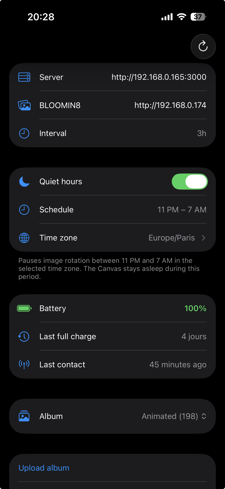

# Canvas

A self-hosted alternative to the official BLOOMIN8 app for managing images on your Canvas e-ink display.

## Why?

The official BLOOMIN8 app has several limitations:

- Cannot upload iOS photo albums directly
- Crashes when uploading more than ~30 photos
- Uploads photos to an unknown third-party cloud
- No widget or quick way to monitor device status

Canvas solves all of these by running a lightweight server on your own network:

- **Bulk upload** — Send your entire photo library without crashes
- **Self-hosted** — Your photos stay on your server, never leave your network
- **iOS app** — Simple SwiftUI app to upload photos and manage playlists
- **Battery widget** — iOS lock screen widget showing battery level and days since last charge

## How It Works

1. Upload photos from the iOS app to your Canvas server
2. Start a playlist — the server wakes the e-ink device
3. The device periodically pulls a new image from the server and displays it
4. The iOS widget shows the current battery level at a glance

## Installation

### Docker Compose

Create a `docker-compose.yml`:

```yaml
services:
  canvas-server:
    image: moifort/bloomin8:latest
    container_name: canvas-server
    restart: unless-stopped
    environment:
      HOST: 0.0.0.0
      PORT: "3000"
      NITRO_SERVER_URL: http://<YOUR_SERVER_IP>:3000
    ports:
      - "3000:3000"
    volumes:
      - ./data:/app/data
```

> Replace `<YOUR_SERVER_IP>` with the local IP address of the machine running the server (e.g. `192.168.0.165`). The BLOOMIN8 device uses this URL to pull images, so it must be reachable on your network.

Then start the server:

```bash
docker compose up -d
```

### CasaOS

A ready-to-use CasaOS configuration is available in `docker-compose.casaos.yml`. Import it directly from the CasaOS dashboard.

### iOS App

Build and install the iOS app from `ios/Canvas/` using Xcode. On first launch, set the server URL to point to your Canvas server (e.g. `http://192.168.0.165:3000`).



### iOS Widget

After installing the app, add the **Canvas Battery** widget to your lock screen or home screen. It refreshes every 15 minutes and displays the current battery percentage of your e-ink display.


## Docker Hub

The Docker image is available at [moifort/bloomin8](https://hub.docker.com/r/moifort/bloomin8).
