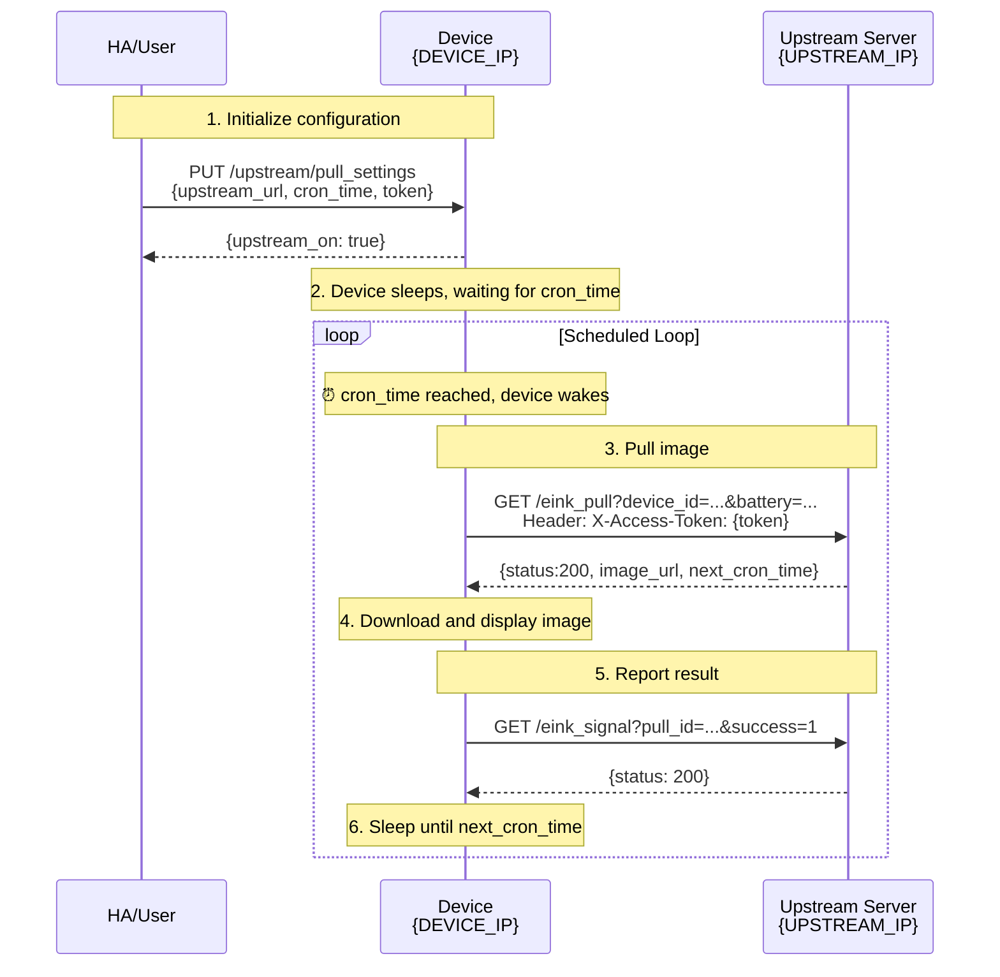

# Schedule Pull API -- BLOOMIN8 CANVAS

**Last Updated**: 2025-12-22

> **Core Concept**: Configure device's upstream server and wake time via `PUT /upstream/pull_settings`. Device wakes at scheduled time, calls your `/eink_pull` to get image URL, displays it, then schedules next wake based on `next_cron_time` in response - forming a loop.

This document describes how to implement scheduled image pulling via the device's `/upstream/pull_settings` endpoint, allowing Home Assistant users to build their own server to control device image scheduling.

---

## 1. Device Endpoint: `/upstream/pull_settings`

### 1.1 Get Current Configuration

```http
GET http://{device_ip}/upstream/pull_settings
```

**Response Example:**
```json
{
  "upstream_on": true,
  "upstream_url": "https://your-upstream.com",
  "token": "eyJhbGci...",
  "next_cron_time": 1766400360,
  "pre_image": "",
  "time": 1766400249
}
```

| Field | Type | Description |
|-------|------|-------------|
| `upstream_on` | Boolean | Whether scheduled pulling is enabled |
| `upstream_url` | String | Upstream server address |
| `token` | String | Access token |
| `next_cron_time` | Integer | Next wake time (Unix timestamp in seconds, 0 = not set) |
| `pre_image` | String | Last displayed image URL |
| `time` | Integer | Device current time (Unix timestamp in seconds) |

### 1.2 Update Configuration

```http
PUT http://{device_ip}/upstream/pull_settings
Content-Type: application/json

{
    "upstream_on": true,
    "upstream_url": "https://your-upstream.com",
    "token": "your-custom-token",
    "cron_time": "2025-11-01T08:30:00Z"
}
```

### 1.3 Parameters

| Parameter | Type | Required | Description |
|-----------|------|----------|-------------|
| `upstream_on` | Boolean | No | Enable/disable scheduled pulling. `false` stops scheduling |
| `upstream_url` | String | No | Upstream server address (device will call `{upstream_url}/eink_pull`) |
| `token` | String | No | Custom token, device includes in Header when calling upstream |
| `cron_time` | String | No | Next pull time, **must be UTC ISO 8601 format**, e.g. `2025-11-01T08:30:00Z` |

> **Note**: PUT uses ISO 8601 format for `cron_time` (e.g. `2025-11-01T08:30:00Z`), but GET returns `next_cron_time` as Unix timestamp (seconds).

**Response:** Returns updated fields
```json
{
  "upstream_on": true
}
```

---

## 2. Upstream Endpoints: APIs You Need to Implement

When device wakes at `cron_time`, it calls the following endpoints on your server:

### 2.1 `/eink_pull` - Device Pulls Image

**Device Request:**
```http
GET {upstream_url}/eink_pull?device_id={device_id}&pull_id={uuid}&cron_time={iso_time}&battery={percent}
X-Access-Token: {your-token}
```

**Query Parameters:**

| Parameter | Type | Description |
|-----------|------|-------------|
| `device_id` | String | Device unique identifier |
| `pull_id` | String | Unique ID for this pull request (UUID) |
| `cron_time` | String | Current scheduled time (ISO 8601 UTC) |
| `battery` | Integer | Device battery percentage |

**Your server should return:**

#### Case 1: Image available

```json
{
  "status": 200,
  "type": "SHOW",
  "message": "Image retrieved successfully",
  "data": {
    "next_cron_time": "2025-11-01T09:00:00Z",
    "image_url": "https://your-upstream.com/images/photo_P.jpg"
  }
}
```

#### Case 2: No image available

```json
{
  "status": 204,
  "message": "No image available",
  "data": {
    "next_cron_time": "2025-11-01T09:00:00Z"
  }
}
```

#### Case 3: Stop scheduled pulling

```json
{
  "status": 200,
  "message": "Stopping scheduled pull",
  "data": {
    "next_cron_time": null
  }
}
```

**Key Fields:**

| Field | Description |
|-------|-------------|
| `status` | 200=success, 204=no content |
| `type` | `SHOW`=display image, `RECOVER`=restore default image |
| `next_cron_time` | Next pull time (UTC ISO 8601). Set to `null` or `1970-01-01T00:00:00Z` to stop scheduling |
| `image_url` | Image URL, filename must end with `_P.jpg` or `_L.jpg` to specify orientation |

### 2.2 `/eink_signal` - Device Feedback (Optional)

Device calls this endpoint after displaying image to report result:

**Device Request:**
```http
GET {upstream_url}/eink_signal?pull_id={uuid}&success={0|1}
X-Access-Token: {your-token}
```

**Query Parameters:**

| Parameter | Type | Description |
|-----------|------|-------------|
| `pull_id` | String | Corresponding pull_id from eink_pull |
| `success` | Integer | 0=failed, 1=success |

**Your server can return:**
```json
{
  "status": 200,
  "message": "Feedback recorded"
}
```

---

## 3. Workflow

```
DEVICE_IP   = Device IP (e.g. 192.168.1.100)
UPSTREAM_IP = Upstream server IP (e.g. 192.168.1.50:8080)
```



---

## 4. Examples

### Example 1: Pull image every 30 minutes

**Initialize configuration:**
```http
PUT http://192.168.1.100/upstream/pull_settings
Content-Type: application/json

{
    "upstream_on": true,
    "upstream_url": "http://192.168.1.50:8080",
    "token": "my-secret-token",
    "cron_time": "2025-11-01T08:00:00Z"
}
```

**Server `/eink_pull` response logic:**
```python
from datetime import datetime, timedelta

def eink_pull(request):
    # Get current UTC time
    now = datetime.utcnow()
    # Calculate time 30 minutes later
    next_time = now + timedelta(minutes=30)

    # Return image and next time
    return {
        "status": 200,
        "type": "SHOW",
        "message": "success",
        "data": {
            "next_cron_time": next_time.strftime("%Y-%m-%dT%H:%M:%SZ"),
            "image_url": "http://192.168.1.50:8080/images/current_P.jpg"
        }
    }
```

### Example 2: Display only when new image available

```python
image_queue = []  # Image queue

def eink_pull(request):
    now = datetime.utcnow()
    next_time = now + timedelta(minutes=10)  # Check again in 10 minutes

    if image_queue:
        image_url = image_queue.pop(0)
        return {
            "status": 200,
            "type": "SHOW",
            "data": {
                "next_cron_time": next_time.strftime("%Y-%m-%dT%H:%M:%SZ"),
                "image_url": image_url
            }
        }
    else:
        return {
            "status": 204,
            "message": "No new image",
            "data": {
                "next_cron_time": next_time.strftime("%Y-%m-%dT%H:%M:%SZ")
            }
        }
```

### Example 3: Dynamic scheduling with image queue

Use a time-keyed queue `{cron_time: ImageObject}` for precise scheduling:

```python
# Queue: key = scheduled time, value = image info
image_queue = {
    "2025-11-01T09:00:00Z": {"url": "http://server/morning_P.jpg"},
    "2025-11-01T18:00:00Z": {"url": "http://server/evening_P.jpg"},
}

def eink_pull(request):
    cron_time = request.args.get("cron_time")
    now = datetime.utcnow()

    # Check if image scheduled for this time
    if cron_time in image_queue:
        image = image_queue.pop(cron_time)
        # Find next scheduled time, or poll in 30min
        next_time = min(image_queue.keys()) if image_queue else None
        return {
            "status": 200,
            "type": "SHOW",
            "data": {
                "next_cron_time": next_time or (now + timedelta(minutes=30)).strftime("%Y-%m-%dT%H:%M:%SZ"),
                "image_url": image["url"]
            }
        }
    else:
        # No image - poll again in 10min until queue has entry
        next_time = min(image_queue.keys()) if image_queue else (now + timedelta(minutes=10)).strftime("%Y-%m-%dT%H:%M:%SZ")
        return {
            "status": 204,
            "data": {"next_cron_time": next_time}
        }
```

**Key points:**
- `status: 204` + fixed interval = polling mode (no image yet)
- `status: 200` + exact time = precise scheduling (image ready at specific time)
- Queue with `cron_time` as key enables time-sensitive image delivery

### Example 4: Stop scheduled pulling

**Method 1: Via device endpoint**
```http
PUT http://192.168.1.100/upstream/pull_settings
Content-Type: application/json

{
    "upstream_on": false
}
```

**Method 2: Via server response**

Regardless of whether an image is returned (status 200 or 204), setting `next_cron_time` to `null` or `1970-01-01T00:00:00Z` tells device to stop scheduling - there will be no next pull.

```json
{
  "status": 200,
  "data": {
    "next_cron_time": null
  }
}
```

or

```json
{
  "status": 204,
  "data": {
    "next_cron_time": "1970-01-01T00:00:00Z"
  }
}
```

---

## 5. Important Notes

1. **Timezone**: `cron_time` and `next_cron_time` must use **UTC timezone** (ending with `Z`)
   - Correct: `2025-11-01T08:30:00Z`
   - Wrong: `2025-11-01T16:30:00+08:00`

2. **Time Validity**: `next_cron_time` must be a **future** time, otherwise device may not schedule correctly

3. **Token Validation**: Recommended to validate `X-Access-Token` header on server side to ensure requests come from your device

4. **Image Requirements**:
   - **Format**: Must be JPEG format (`.jpg`)
   - **Resolution**: Should match device screen (e.g. 480x800, 1200x1600)
   - **Orientation Rules**:
     - Image must be stored in **portrait** orientation
     - If original is landscape, **rotate 90° clockwise** before saving
     - Filename suffix specifies display orientation:
       - `_P.jpg` = Portrait display
       - `_L.jpg` = Landscape display (device rotates 90° counter-clockwise)
     - Examples: `photo_L.jpg` (landscape), `photo_P.jpg` (portrait)
   - Image URL must be directly accessible by device

5. **Network Requirements**: Device must be able to access your configured `upstream_url`

6. **Recovery After Stop**: Once device stops scheduled pulling (receives `next_cron_time=null`), you need to manually wake the device and call `/upstream/pull_settings` again with a valid `cron_time`

---
